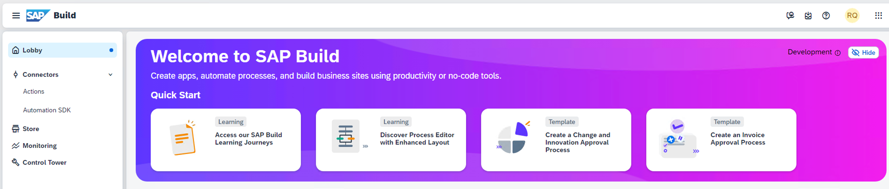
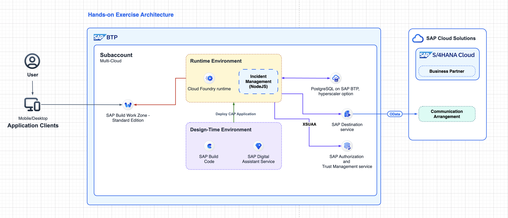
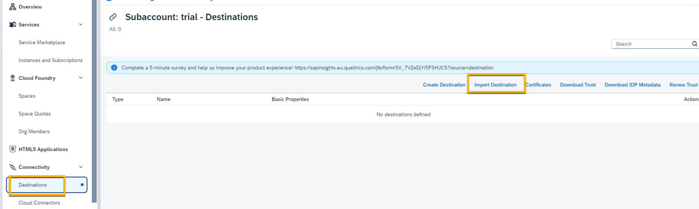
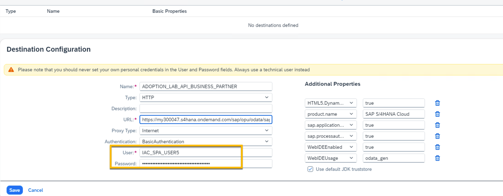
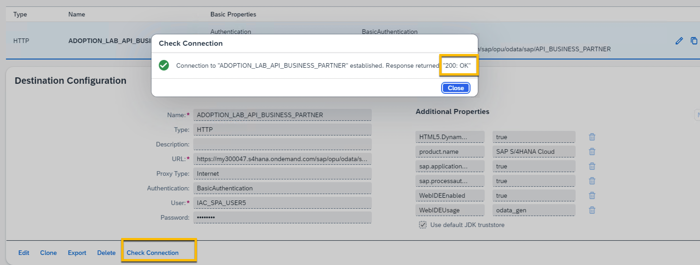

# 开始准备
---
让我们开始练习，并检查是否一切就绪。
请确保您已完成以下所有必要的先决条件。如果没有，请尽早提出，以便我们可以在会话期间帮助您。

## 先决条件
请保留以下链接和资源：

1. 确保您已访问浏览器（最好是Google Chrome）。
2. 登录到开发大厅

4. 如果您将所有构件部署到同一 SAP BTP 账户，并且不同名称和标识很重要以避免冲突，请使用您的**XXX**号。请确保您记得它。

## 实操架构

1. 在进行动手操作练习之前，请订阅所需的 BTP 服务：[设置指南](https://dam.sap.com/mac/u/a/C5HSPyJ.htm?rc=10&doi=SAP1080426)

## 导入 S/4HANA Cloud 集成目的地

> 下载用于 S/4HANA Cloud 的示例目标 [ADOPTION_LAB_API_BUSINESS_PARTNER](https://robin-qiu.github.io/BTP-CAP-Development-with-SAP-Build-Code---Bring-Your-Own-Tenant/vx_attachments/477573873607615/ADOPTION_LAB_API_BUSINESS_PARTNER ':include')  :truck::truck::truck:。

2. 将目标导入您的 BTP 子账户。

3. 在动手实验室期间，您会被提供凭据。

4. 如果您尝试“**检查连接**”，则会收到 **"200: OK"** 消息，并且这是正常反馈。
