<div class="draftWatermark"></div>

# Exercise 2 - Refer to an SAP S/4HANA Cloud Service in Your Data Model
---

In this exercise, we will add an SAP S/4HANA Cloud service, the Business Partner, to our project and associate it with our incident management model.


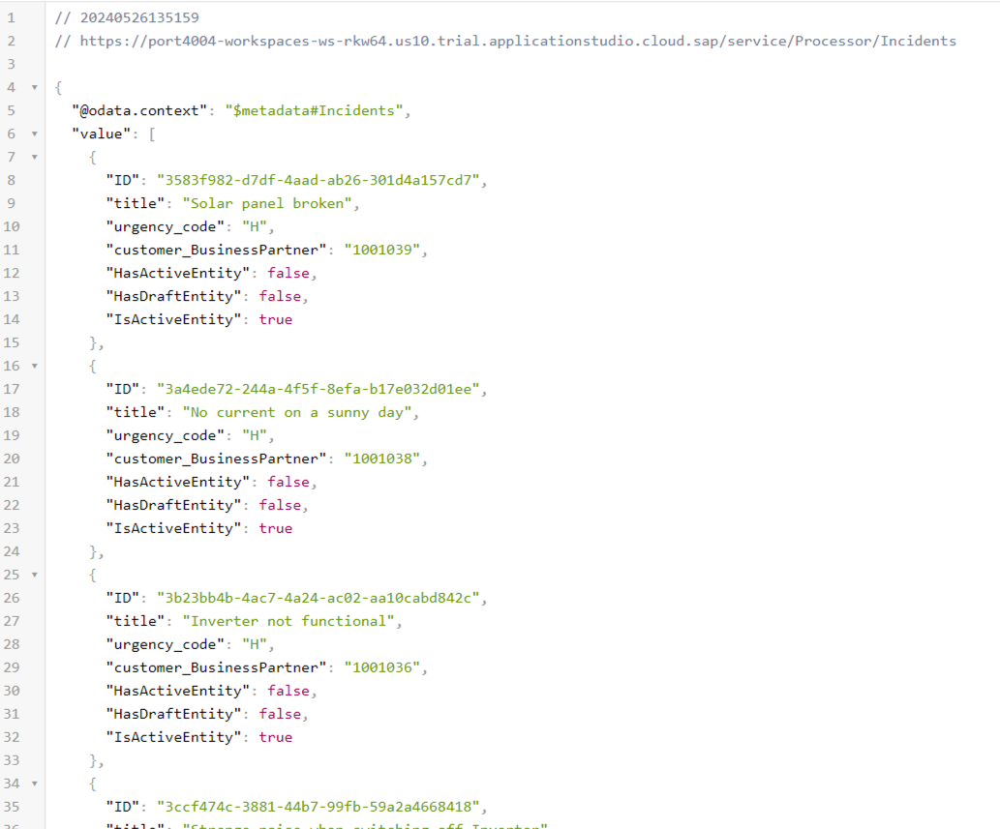

##### Discover an SAP S/4HANA Cloud Service and Add it to Your Data Model

From the **Storyboard**, click "+" on the **External Resources** tile. This opens the **Service Center** on the left-hand side.

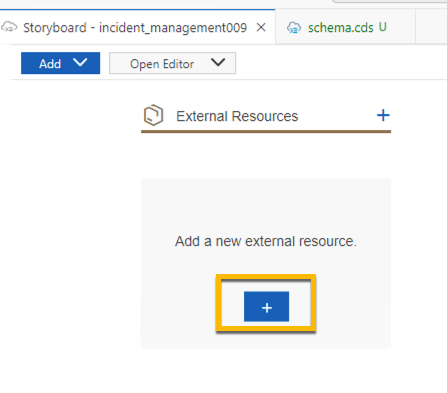

There, you can see the **SAP System** node. Technically, it contains destinations to OData services in your backend system that an administrator has set up for you. These can be services from an SAP S/4HANA system or from other SAP backend systems.

Expand **SAP System > lcapteched**, and select **ADOPTION_LAB_API_BUSINESS_PARTNER**.

You can now see the details of the chosen service, its entities, the properties for each entity, and general data about the service.<br>
Click **Add External Data Model** in the upper-right corner of the screen.<br>
This adds the chosen service to you project.

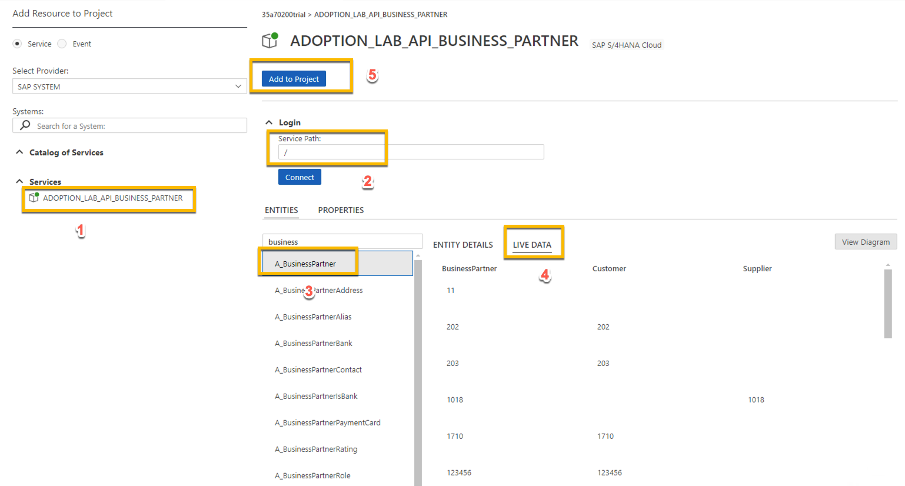

Return to the **Storyboard**. After a couple of seconds, the new service is displayed in the **External Resources** tile.

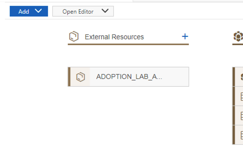

##### Associate a Business Partner Entity with the Incidents Entity

From the **Storyboard**, under **Data Models**, select an entity and click **Open in Graphical Modeler** to get back to the graphical modeler.

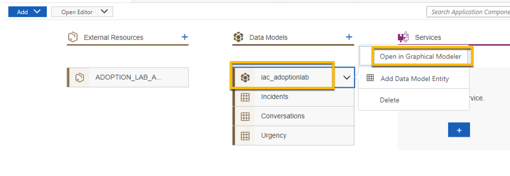

From the **Incidents** entity, click  the **Add Relationship** icon.<br>


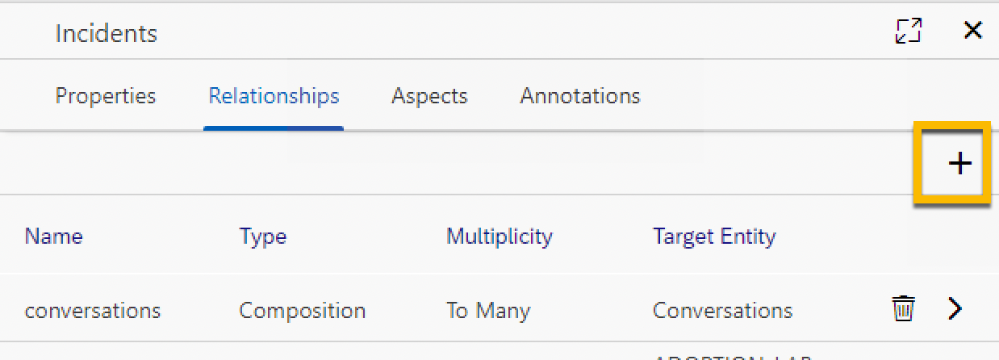

This creates a new association to a Business Partner entity. However, we don't see the Business Partner on the canvas. This is because it is in a different namespace than our own Incidents entity.

A new dialog appears.<br>
1. From the **Target Entity** dropdown list, select **API_BUSINESS_PARTNER-A_BusinessPartner**. <br>
2. Change the suggested **Property Name** to **customer**. <br>
3. Leave all the other suggestions (**Association** and **To-One**) as they are, and click **Create**.

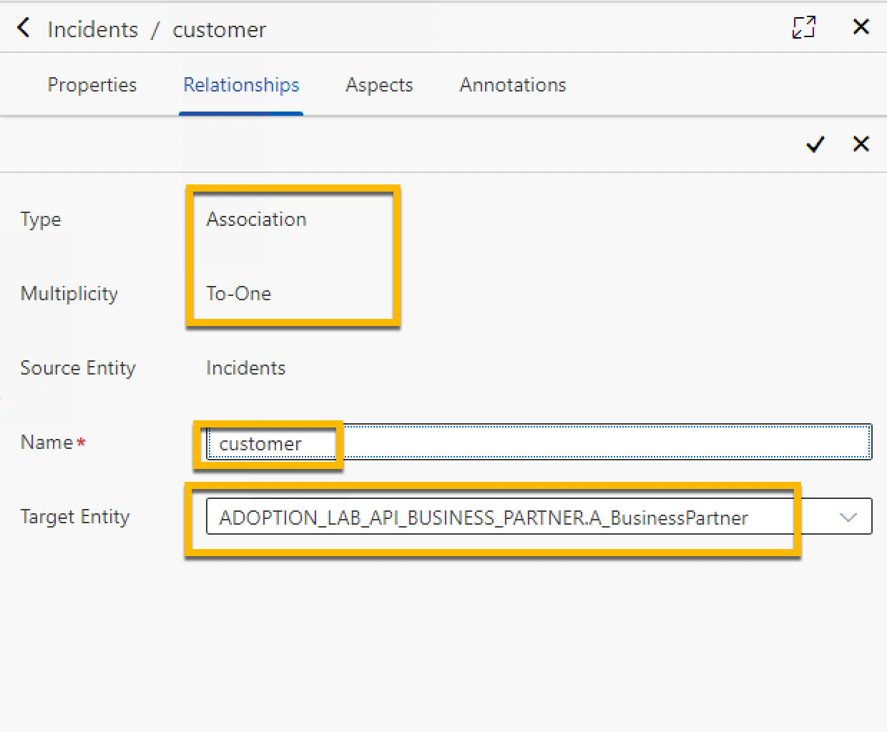

You can now see the final data model:

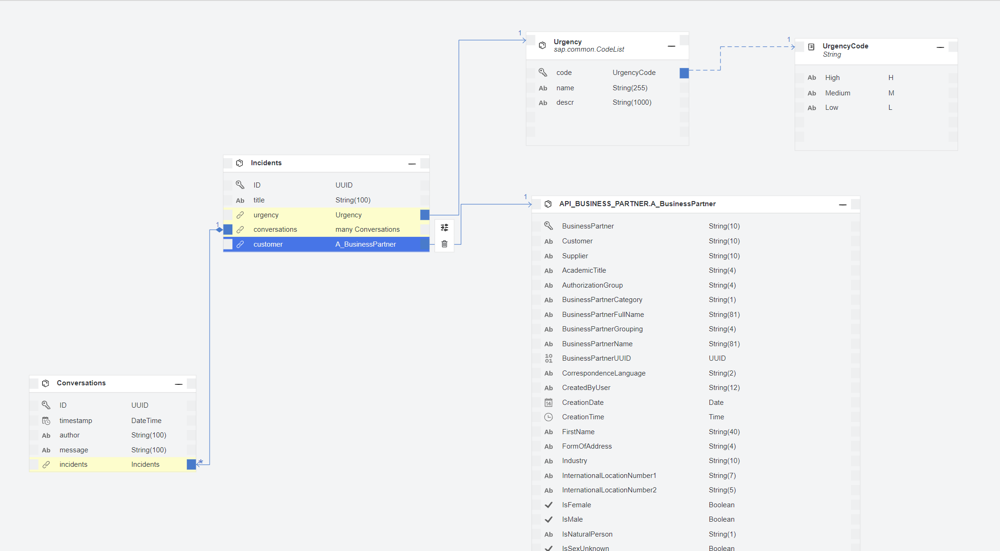


## Summary

You have added an external reference to the SAP S/4HANA Cloud backend system and connected it to your **Incidents** data model.

---

### Add Sample Data


We will now populate our data model with some sample data so that we can test our service. Note that even though it says sample data, the data can be of two types:
- Fixed values that are part of your application and should be deployed along with the application. An example could be the data for **Urgency** if there is only a fixed set of urgencies that cannot be changed
- Sample data that is only used to test the services and applications that you create and that should not be part of a productive deployment.

Go to the **Storyboard** and from the **Data Models** tile, click the **Urgency** entity, and select **Add Sample Data**.<br>
The Sample Data Editor opens.

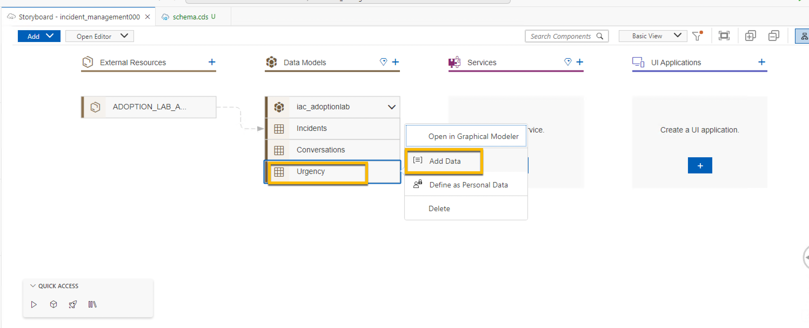


Click **Add**.<br>
Leave the **name** field empty.<br>
In the **descr** field, enter Low, Medium and High for each row respectively.

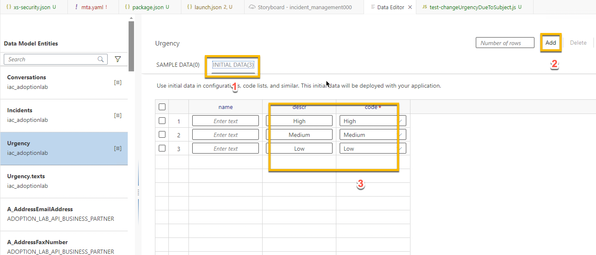

Now we will import data from a file to the **A_BusinessPartner** entity.

Open the [Customers](https://robin-qiu.github.io/BTP-CAP-Development-with-SAP-Build-Code---Bring-Your-Own-Tenant/vx_attachments/477573873607615/customers.csv ':include') :floppy_disk::floppy_disk::floppy_disk: file, and click the **Download** icon.

Alternatively, using a local text editor, create a local file named `customers.csv`.<br>
Add the following content to the file and save it locally:
```
BusinessPartner,FirstName,LastName
1001036,Daniel,Watts
1001038,Stormy,Weathers
1001039,Sunny,Sunshine
```

From the editor, select **A_BusinessPartner** and click **Import**.<br>
From the file selection dialog box that opens, select the 'customers.csv' file that you created.<br>
The data is added.


Now we will import data from a file to **Incidents** entity.

Open the [Incidents](https://robin-qiu.github.io/BTP-CAP-Development-with-SAP-Build-Code---Bring-Your-Own-Tenant/vx_attachments/477573873607615/incidents.csv ':include') :floppy_disk::floppy_disk::floppy_disk: file, and click the **Download** icon.

Alternatively, using a local text editor, create a local file named `incidents.csv`.
Add the following content to the file and save it locally:

```
ID,title,urgency_code,customer_BusinessPartner
3b23bb4b-4ac7-4a24-ac02-aa10cabd842c,Inverter not functional,H,1001036
3a4ede72-244a-4f5f-8efa-b17e032d01ee,No current on a sunny day,H,1001038
3ccf474c-3881-44b7-99fb-59a2a4668418,Strange noise when switching off Inverter,M,1001039
3583f982-d7df-4aad-ab26-301d4a157cd7,Solar panel broken,H,1001039
```

From the editor, select **Incidents** and click **Import**.<br>
From the file selection dialog box that opens, select the 'incidents.csv' file that you created.<br>
The data is added.

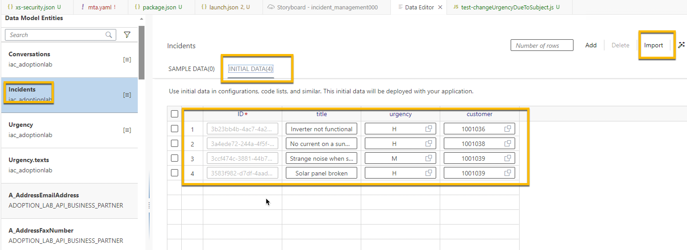

For the last step, we will import data from a file to the **Conversations** entity.<br>

Open the [Conversations](https://robin-qiu.github.io/BTP-CAP-Development-with-SAP-Build-Code---Bring-Your-Own-Tenant/vx_attachments/477573873607615/conversations.csv ':include') :floppy_disk::floppy_disk::floppy_disk: file, and click the **Download** icon.<br>

Alternatively, using a local text editor, create a local file named `conversations.csv`.<br>
Add the following content to the file and save it locally:

```
ID,incidents_ID,timestamp,author,message
2b23bb4b-4ac7-4a24-ac02-aa10cabd842c,3b23bb4b-4ac7-4a24-ac02-aa10cabd842c,1995-12-17T03:24:00Z,Harry John,Can you please check if battery connections are fine?
2b23bb4b-4ac7-4a24-ac02-aa10cabd843c,3a4ede72-244a-4f5f-8efa-b17e032d01ee,1995-12-18T04:24:00Z,Emily Elizabeth,Can you please check if there are any loose connections?
9583f982-d7df-4aad-ab26-301d4a157cd7,3583f982-d7df-4aad-ab26-301d4a157cd7,2022-09-04T12:00:00Z,Sunny Sunshine, please check why the solar panel is broken
9583f982-d7df-4aad-ab26-301d4a158cd7,3ccf474c-3881-44b7-99fb-59a2a4668418,2022-09-04T13:00:00Z,Bradley Flowers,What exactly is wrong?
```

From the editor, select **Conversations** and click **Import**.<br>
From the file selection dialog box that opens, select the 'conversations.csv' file that you created.<br>
The data is added.

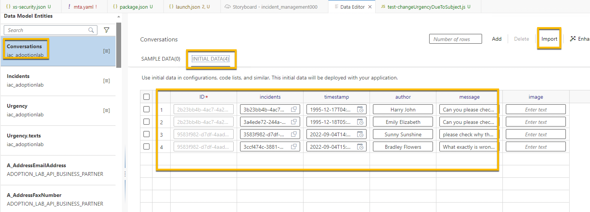

## Summary

We have now added some sample data to two data models that we can use later to test the service that we will create.


---


### Create a Service (API)


After the creation of the data model (persistence layer), we will now select what to expose to the outside world as an API. This API can then be consumed by UI apps, workflows, etc. For this purpose, we will add several entities to a service. CAP will expose this service automatically as an OData service.

##### Create New Service Entities

We will add 4 entities to the service: Customers, Incidents, Conversations, and Urgency.

Go back to the **Storyboard** tab in SAP Business Application Studio.

In the **Storyboard**, from the **Services** tile, click **+** button, and input service name as **Processor**.
The CDS Graphical Modeler opens.

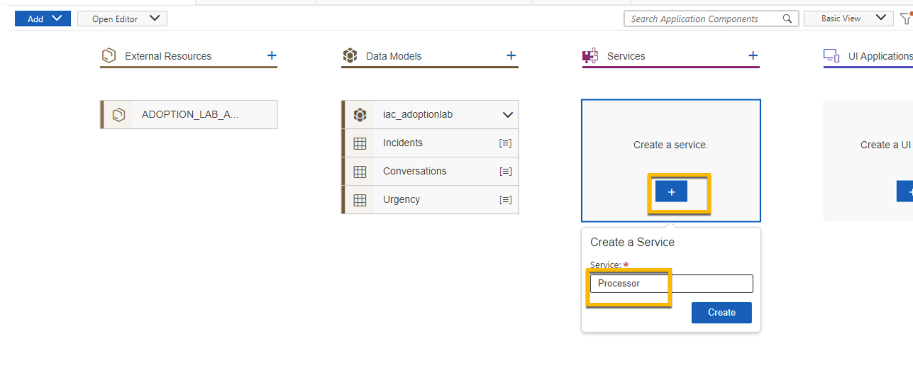

From the toolbar, click **Add Entity** and click **Entity1**.
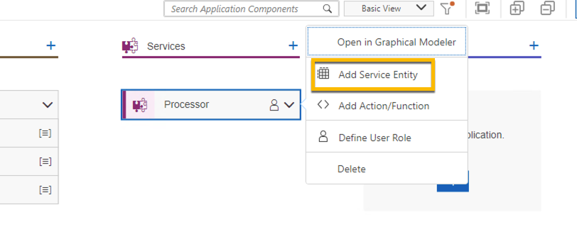

The **New Projection** dialog box opens.


From the toolbar, click **Add Entity**, and click **Entity1**.

The **New Projection** dialog box opens.

Select the **teched.Incidents** entity, make sure that the **Enable draft editing** checkbox is selected, and click **OK**.<br>

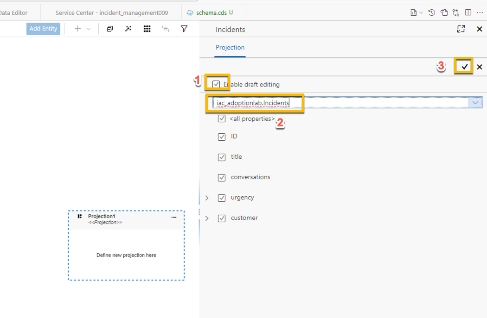

The **Incidents** entity appears in the CDS Graphical Modeler.

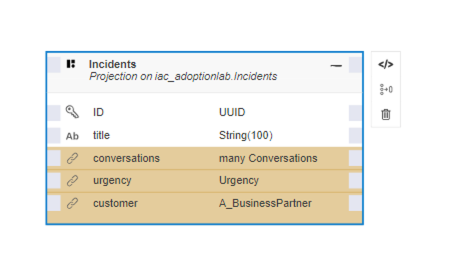

Click **"Open Property Sheet"** icon and import the S/4HANA Cloud OData service

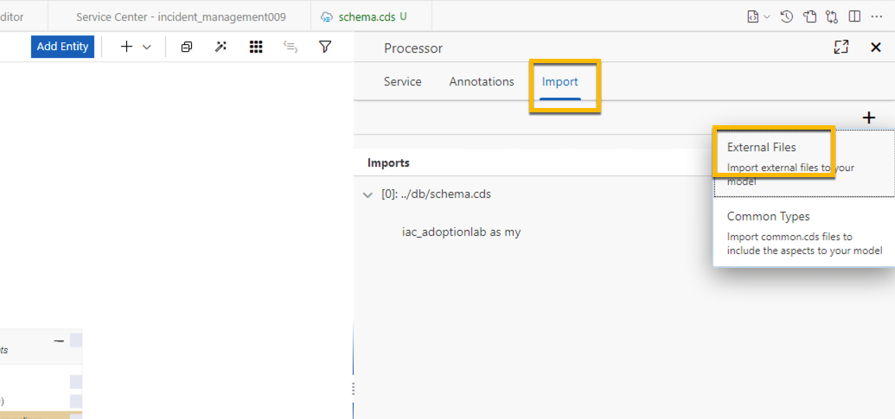

Browse the OData CDS file
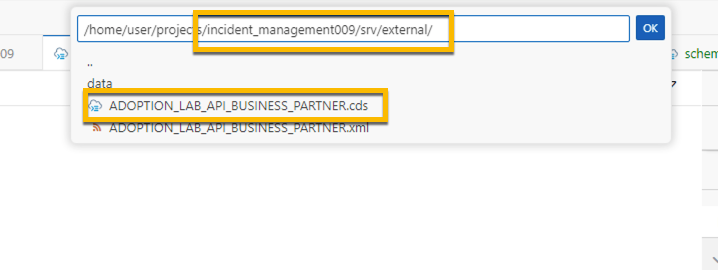

Select the **A_BusinessPartner** entity


Select the **API_Busniess_Partner.A_BusinessPartner** entity, clear the **Enable draft editing** checkbox if not already cleared, and click **OK**.
The **A_BusinessPartner** entity appears in the CDS Graphical Modeler.


1. Click the **Show Details** icon, and select the **Projection** tab.
3. Clear the **all properties** checkbox, and select the following properties:
   
   a. BusinessPartner
    
   b. FirstName
   
   c. LastName


3. **IMPORTANT**: Change the name of the **A_BusinessPartner** entity to **Customers**.

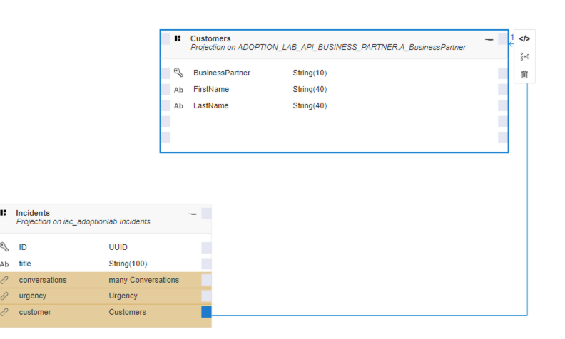


From the toolbar, click **Add Entity** and click **Entity1**.

The **New Projection** dialog box opens.

Select the **teched.Conversations** entity, clear the **Enable draft editing** checkbox, and click **OK**.<br>
The **Conversations** entity appears in the CDS Graphical Modeler.

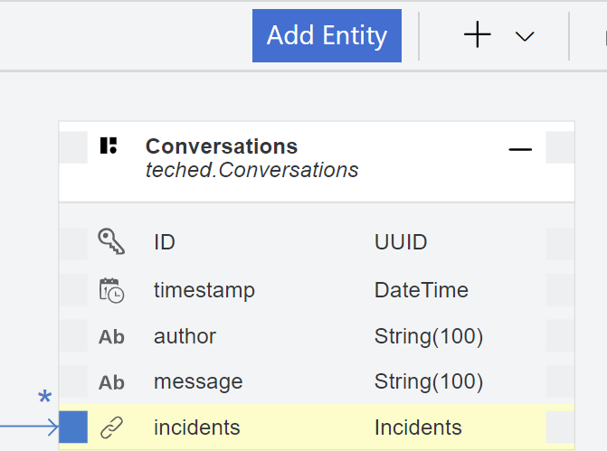

From the toolbar, click **Add Entity** and click **Entity1**.

The **New Projection** dialog box opens.

Select the **teched.Urgency** entity, clear the **Enable draft editing** checkbox, and click **OK**.<br>
The **Urgency** entity appears in the CDS Graphical Modeler.

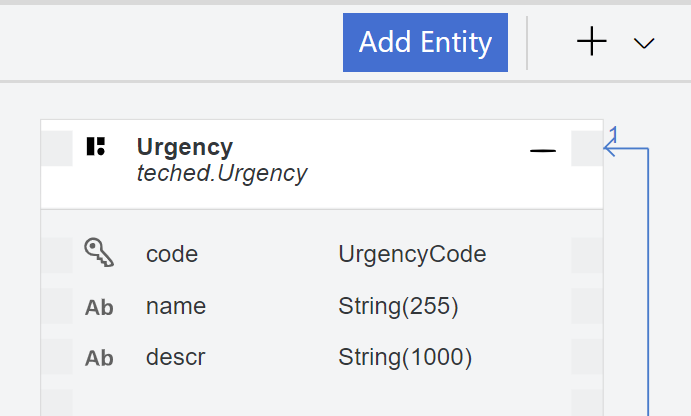
 
Make sure that the **ProcessorService** contains the 4 entities that you just added.


##### Summary
You have now added a **Processor** service to your project. Essentially, this service will expose your data model as an OData V4, RESTful API to your application.

---


### Preview Your Service


Now that we have a service, we can preview it with sample data and with live data without having to deploy to the cloud. 

##### Preview with Sample Data

From the activity bar on the left, click the **Run Configurations** icon.
The **Run Configurations** view opens.

Click the default run configuration: **Run incident_managementXXX-1**.

In the **OData** section that opens, **Mock Data** is selected.

From the **Run Configurations** view, click the **Run Module** icon.

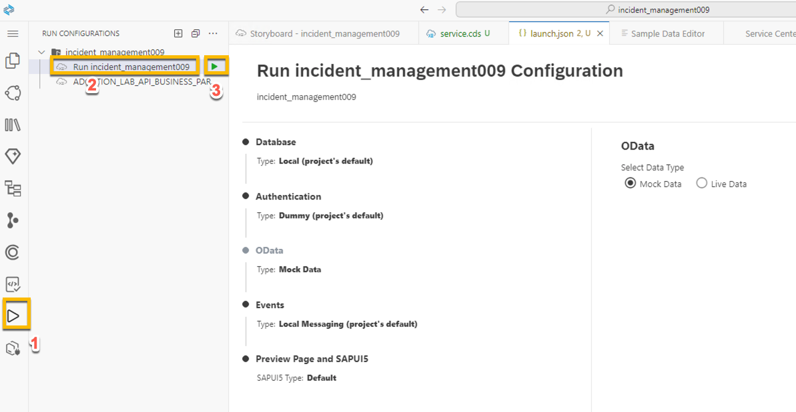

Wait until see the console output like below:
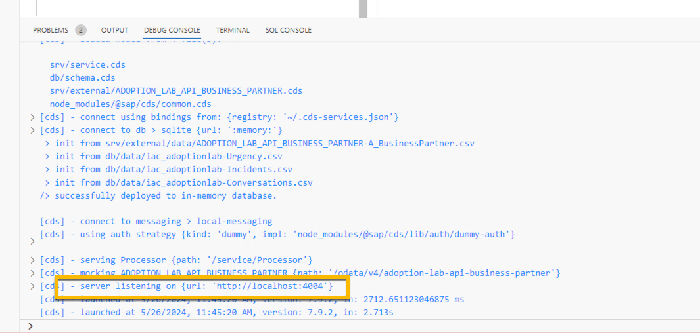

If the pop-ups are blocked by your browser, please unblock lik this:
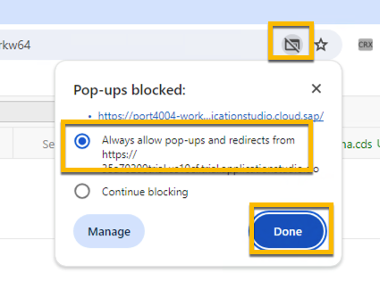

After a couple of seconds, a new browser tab opens and a screen like the one below is displayed.

> Note: If you don't get a new tab, please check whether there is a blocker running in your browser. If so, please allow the SAP Business Application Studio domain to open a new tab.


You can see a preview of the service including the **ProcessorService** in the list of services on the right-hand side.<br>
From the **Customers** row, click the **View as code** icon to preview the list of customers with the sample data.<br>

The **Customers** sample data is displayed.<br>
The data is queried and exposed using OData V4. Please note that this service is run from an in-memory database that is automatically opened for you during the preview, so any modification to the data will not persist.

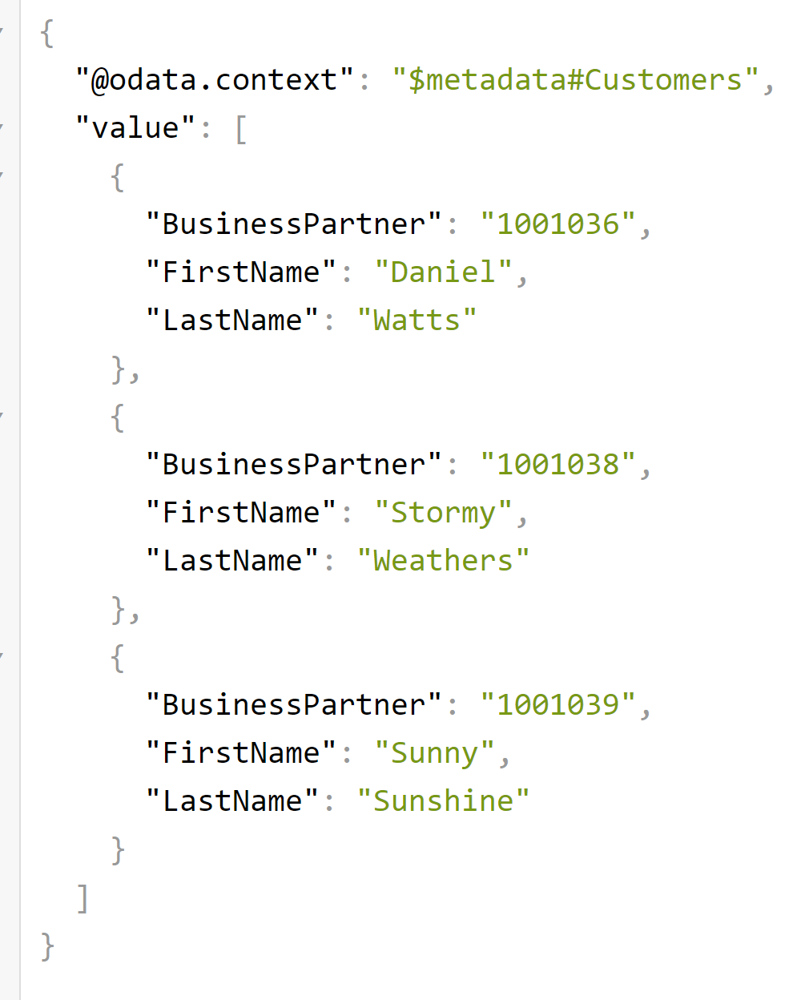


##### Preview with Live Data

Switch back to the tab that has SAP Business Application Studio with your project.<br>
We will now look at the second version of the preview, which uses live data. This time, the data for the business partner is actually fetched from the SAP S/4HANA Cloud system instead of from sample data.

To get there, first click the **Stop Preview** button.


From the activity bar, open the **Run Configurations** view.

Click the **API_BUSINESS_PARTNER** run configuration.<br>
In the **OData** section of the editor that opens, **Live Data** is selected.

From the **Run Configurations** view, click the **Run Module** icon.

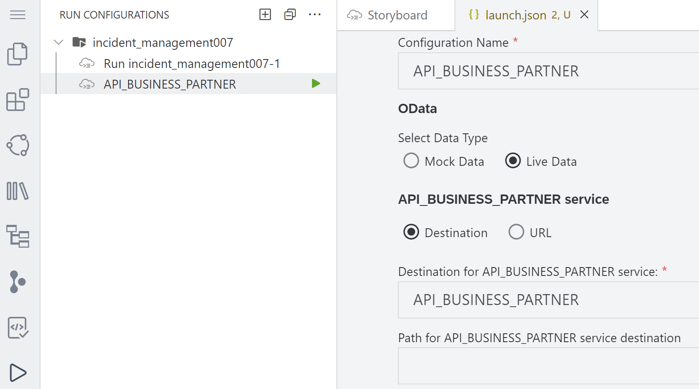

After a couple of seconds, a new browser tab opens and a screen like this is displayed:

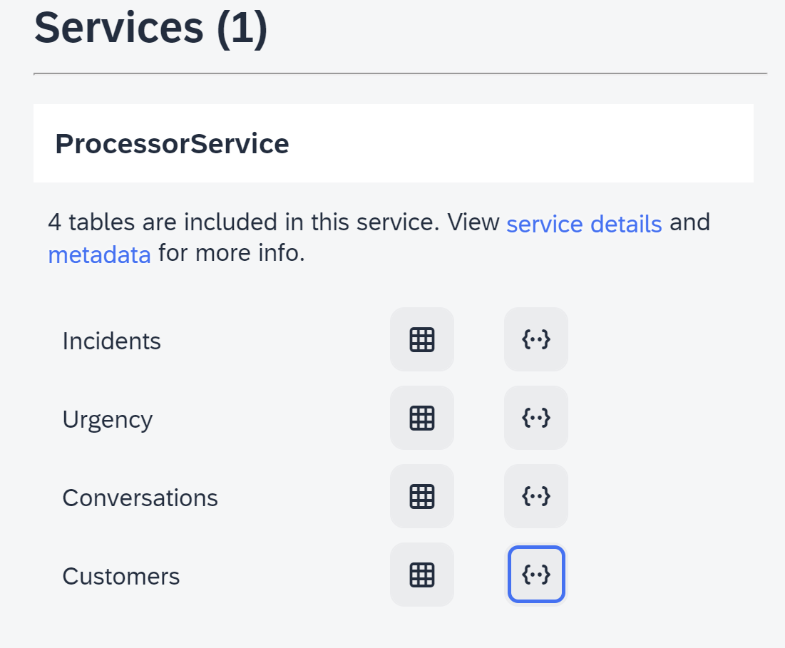

> Note: If you don't get a new tab, please check whether there is a blocker running in your browser. If so, please allow the SAP Business Application Studio domain to open a new tab.

A preview of the service opens and the **ProcessorService** appears in the list of services on the right-hand side.<br>
From the **Customers** row, click the **View as code** icon to preview the list of customers.<br>
This time you will get a lot more data than before. Also, the names are different. This is the real business partner data from the SAP S/4HANA backend.<br>

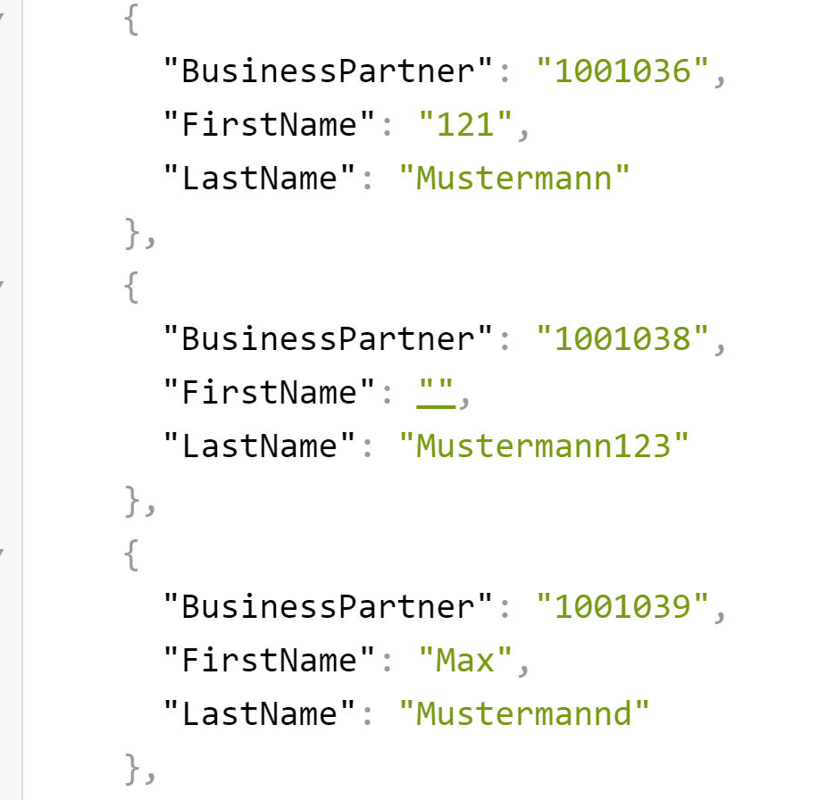

Go to SAP Business Application Studio, and click the **Stop Preview** button.


##### Summary
We have now previewed our service without any deployment.


