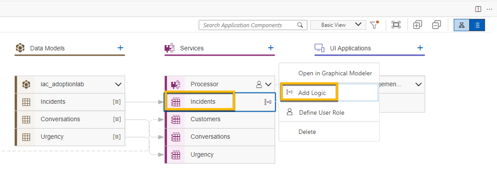
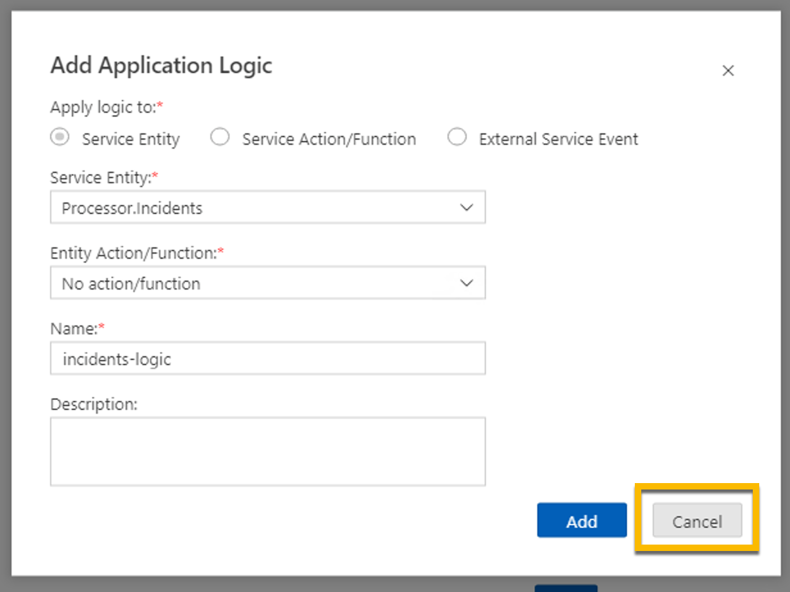
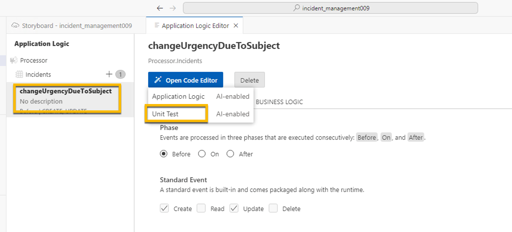
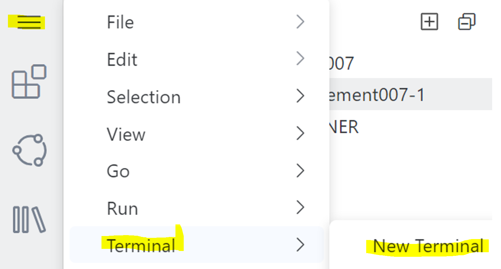
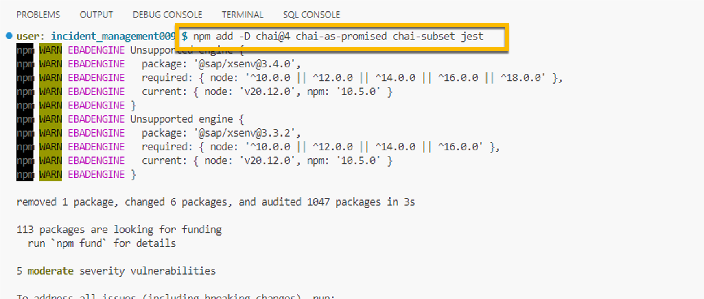
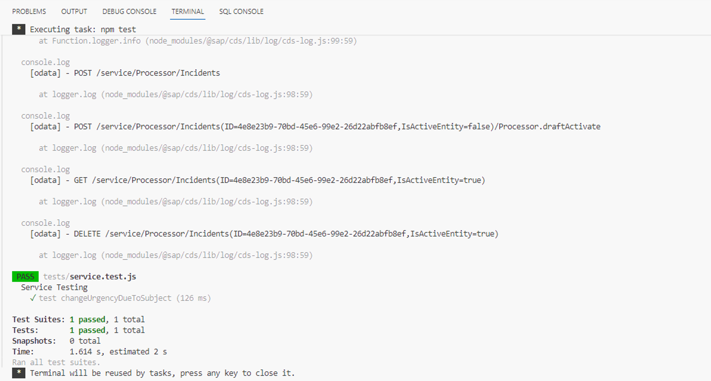

# Exercise 5 - Add Unit Test to the Application
---

In this excercise, we will add a unit test for automatic urgency determination.
The unit test checks that the urgency is raised to **high** according to the incident’s title.

## Create a Test for Updating the Urgency from an Incident's Title

From the **Storyboard**, select the **Processor**, and click **Open in Graphical Modeler**.
The CDS Graphical Modeler opens.

Select the **Incidents** entity and click the **Add Logic** icon next to the entity's title.



Click "Cancel" button



From the **Application Logic Editor**, select **changeUrgencyDueToSubject**, and then click **Open Code Editor > Unit Test**.



Click **Yes** button to activate test environment.


In the **'test-changeUrgencyDueToSubject.js'** file, after the **Your code here** comment , add the following content:

```
  let draftId, incidentId;

  // Create an incident 
  const createIncident = await POST(`/service/Processor/Incidents`, {
    title: 'Urgent attention required!',
  });

  draftId = createIncident.data.ID;
  expect(createIncident.status).to.equal(201);
  expect(createIncident.statusText).to.equal('Created');

  const responseActivate = await POST(
    `/service/Processor/Incidents(ID=${draftId},IsActiveEntity=false)/Processor.draftActivate`
  );
  expect(responseActivate.status).to.eql(201);
  incidentId = responseActivate.data.ID;
  // Test the Urgency
  expect(responseActivate.data.urgency_code).to.eql('H');

  const getIncident = await GET(`/service/Processor/Incidents(ID=${incidentId},IsActiveEntity=true)`);

  expect(getIncident.status).to.eql(200);
  expect(getIncident.data.urgency_code).to.eql('H');

  // Clean up 
  const responseDelete = await DELETE(`/service/Processor/Incidents(ID=${incidentId},IsActiveEntity=true)`);
  expect(responseDelete.status).to.eql(204);
```
 


Now we will run the the test from the terminal.

From the activity bar, select the hamburger icon, and then choose **Terminal > New Terminal**.



The terminal opens. <br>

**Using chai requires these dependencies added to your project:**

```

npm add -D chai@4 chai-as-promised chai-subset jest
```





Copy the following command, paste it in the terminal, and press **Enter** to run the test.

```
basctl --command lcap.applicationLogic.runTest
```


The test starts running, and the following **PASS** indication should be dispalyed in the terminal:




## Summary
We have now added a unit test to the application. 

