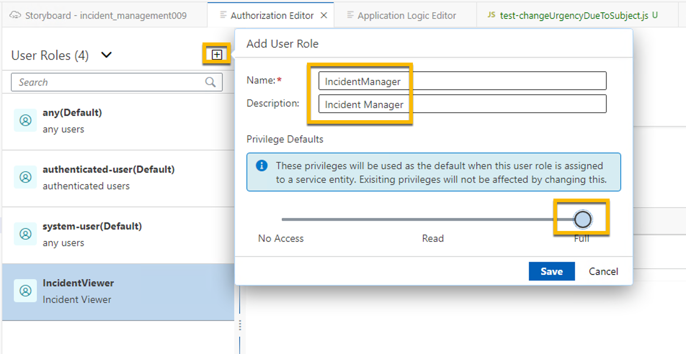
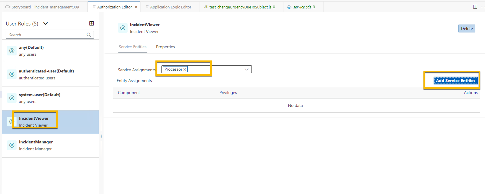
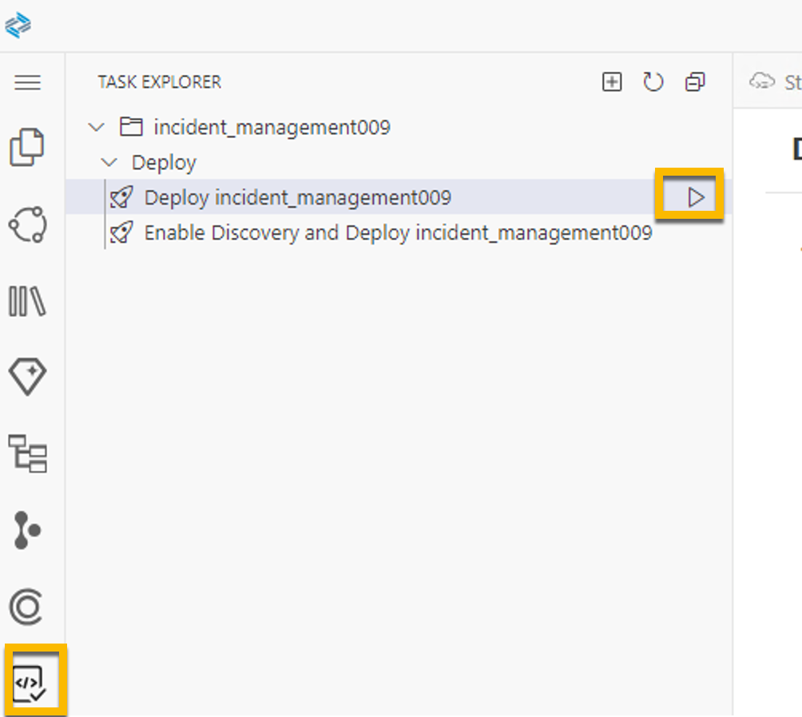
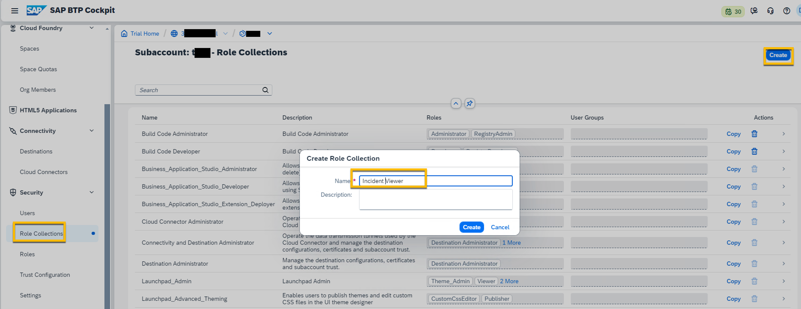
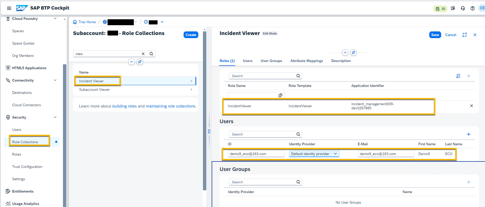
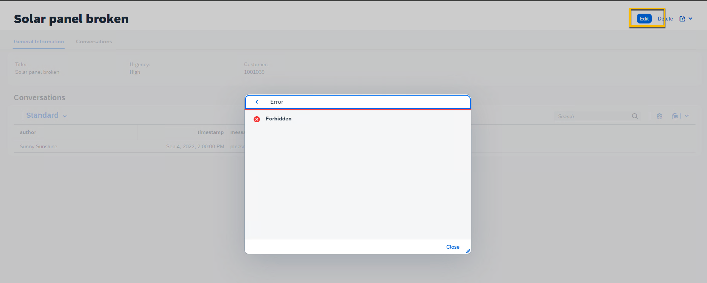
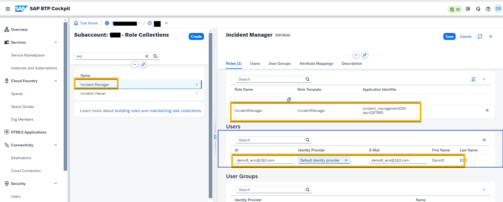
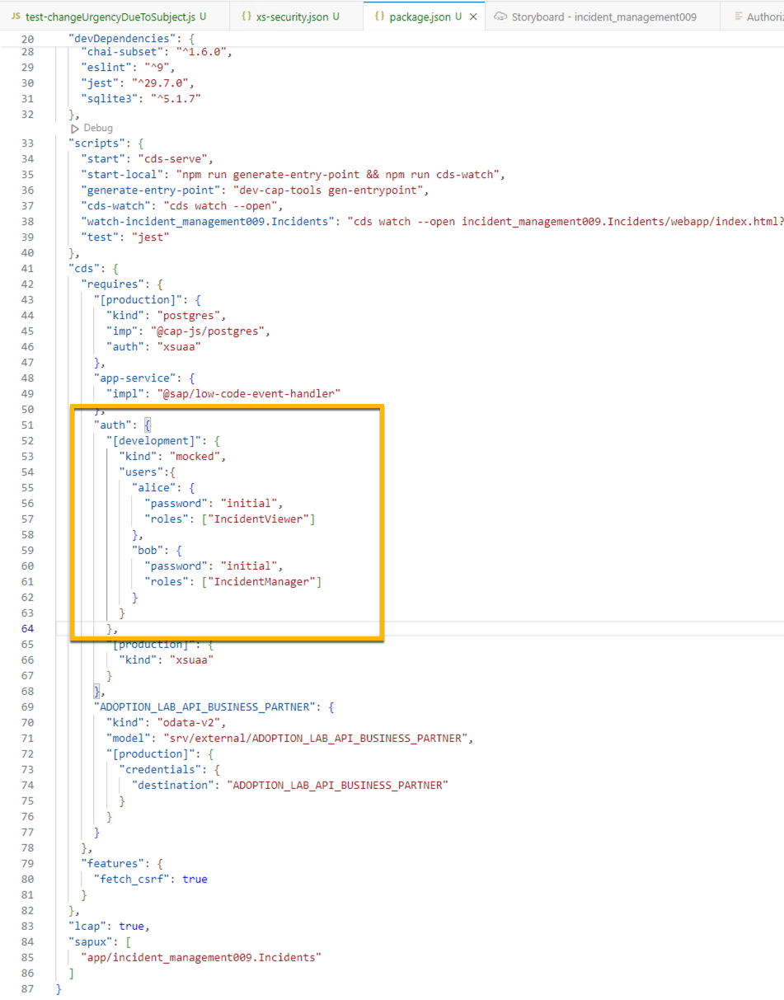

# Exercise 6 - Implement Roles and Authorization Checks In CAP

---

This exercise shows you how to enable authentication and authorization for your CAP application.

You will learn
* How to add role restrictions to entities
* How to add a local user for testing
* How to access the application with a user and password

## Adding CAP role restrictions to entities

1. Select **Processer** service, click **Define User Role** to open Authorization Editor


2. Select U**ser Roles** to add new roles.


3. Click the **+** icon to add new user role.

Add one role name as **IncidentViewer** and set the privilege as **Read**


Add another role name as **IncidentManager**, and set the privilege as **Full**.



4. Next we can assign the role to the service.

Select **IncidentViewer** role and choose Service Assignment as **Processor**



Assign the role to the service entities with Read privilege.


Select IncidentManager role and assign the Full privilege with the service entities.


5. Check the content of the **xs-security.json** file.

You have already added authorization with the requires annotations in the CDS service model. 


Run the following command in the terminal:

`cds add xsuaa --for production`

> Running cds add xsuaa does two things:
> 
> Adds the SAP Authorization and Trust Management service service to the **package.json** file of the INCIDENT-MANAGEMENT project.
> Creates the SAP Authorization and Trust Management service security configuration (that is, the xs-security.json file) for the INCIDENT-MANAGEMENT project.


This is now translated into scopes and role templates for the SAP Authorization and Trust Management service. Hence, a scope and role template for the support role are created in the **xs-security.json** file: (Replace **XXX** with your ID)
```

{
  "scopes": [
    {
      "name": "$XSAPPNAME.IncidentViewer",
      "description": "IncidentViewer"
    },
    {
      "name": "$XSAPPNAME.IncidentManager",
      "description": "IncidentManager"
    }
  ],
  "attributes": [],
  "role-templates": [
    {
      "name": "IncidentViewer",
      "description": "generated",
      "scope-references": [
        "$XSAPPNAME.IncidentViewer"
      ],
      "attribute-references": []
    },
    {
      "name": "IncidentManager",
      "description": "generated",
      "scope-references": [
        "$XSAPPNAME.IncidentManager"
      ],
      "attribute-references": []
    }
  ],
  "xsappname": "incident_managementXXX",
  "tenant-mode": "dedicated"
}
```

6. Re-deploy the application and check the new roles.



After the deployment, you can find new created incident roles are under the subaccount Roles page.


If you try to the application, there will be a **Forbidden** error message pop-ups.


7. Assign the new roles and check the access control.




Firstly, create one role collection as **Incident Viewer** and add role **IncidentViewer** to it. 

Assign the role collection to yourself.





You will have the access to search records but cannot edit.




Let's create a new role collection as **Incident Manager** and bind the **IncidentManager**. 

Assign it to yourself and check the application access. 




Now you can search and edit the records.


## Add users for local testing

The authorization checks that you added to the CAP model apply not only when deployed in the cloud but also when testing locally. Therefore, you need a way to log in to the application locally.

CAP offers a possibility to add local users for testing as part of the cds configuration. In this tutorial, you use the development profile in package.json file to add the users.

1. Open the package.json file in your project directory.


In the package.json file, add the following code:

```

"auth": {
        "[development]": {
          "kind": "mocked",
          "users":{
            "alice": {
              "password": "initial",
              "roles": ["IncidentViewer"]
            },
            "bob": {
              "password": "initial",
              "roles": ["IncidentManager"]
            }
          }
        },
        "[production]": {
          "kind": "xsuaa"
        }
      },


```




Each user entry is part of the users object. The key is the id of the user and they can have different properties. For this scenario you define a password and an array of roles.

You have added two users:

* **alice** with the **IncidentViewer** role and the **initial** password
* **bob** with the **IncidentManager** role and the **initial** password


> Keep in mind that the CAP roles and the Cloud Foundry roles and scopes are not the same thing. See Authentication in the CAP documentation.


2. Set the **Authentication** as **Mocked** in the Run Configuration

Click the **Run** icon


Click the Incidents tile to open th app.


It will pop-up the Sign in dialog and input the **alice** credential.


Try to edit the record and it will pop-up Forbidden error message.


Logout and switch to **bob** credential to check the access privilege.


Now you can edit the record and have the full privilege.


**Congratulations!**
You have a better understanding of the authentication and authorization in CAP application.