

# Exercise 8 - Create App with SAP Build Code and Joule copilot

---
# SAP Build Code and Joule copilot

### Overview
In this unit, we want to create a customer loyalty program application. Customer can get bonus points for their purchases of products and can redeem these points.

Generative AI powered Development using Joule in SAP Build Code.

1. Data Model and Service Creation
1. Sample Data
1. Application Logic

 
 

**Introduction to SAP Build Code**

SAP Build Code is a turn-key development environment that combines runtime and design time capabilities with built-in solutions for DevOps and Application Lifecycle Management.

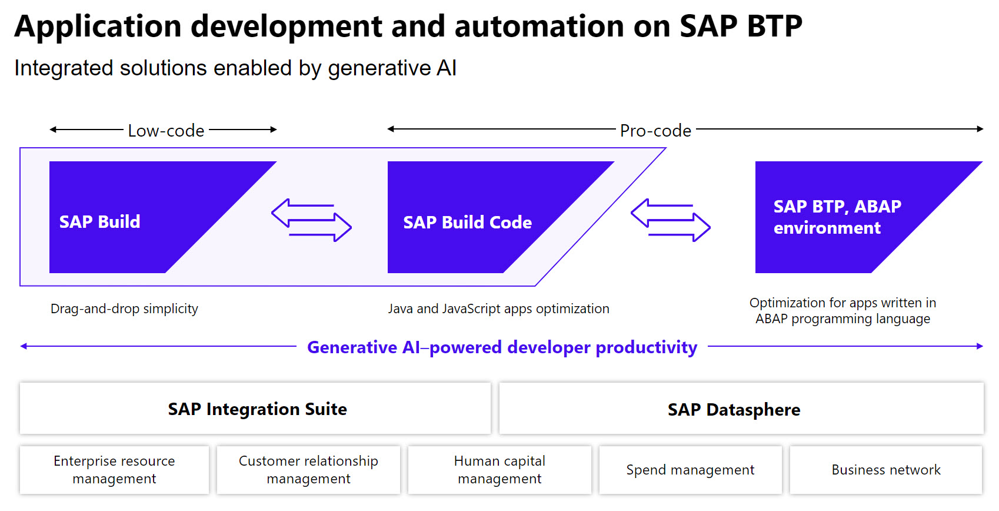

**Benefits of SAP Build Code**

* Achieve a clean core by developing side-by-side extensions with SAP Build Code
* Optimize developer efficiency with generative AI, productivity tools, and application lifecycle management
* Enable developers to build and extend powerful end-to-end business applications with programming language of choice
* Leverage interoperability between classic development and low-code development tools

**Key capabilities of SAP Build Code**
* Differentiate cloud solution with stable and future-proof foundation, solution becomes future proof and works with different editions of S/4HANA, and quality assurance options included
* Enable developers to code faster and smarter, code generation based on generative AI, Ease of Application Lifecycle Management
* Application and extension development, Integrate with SAP and non-SAP systems
* Easy access for all types of developers with centralized Lobby, for Fusion Development

### Create Project

The starting point for this tutorial is the lobby of SAP Build, the central entry point for all SAP Build products.

1. Launch the SAP Build Lobby (if you are not already in the Lobby)
2. Click on the Create button

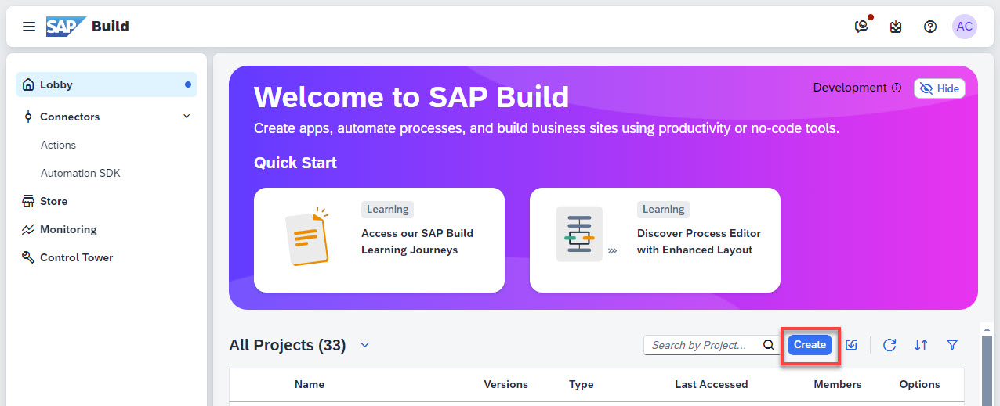

3. Select Build an Application

4. Select SAP Build Code

  

5. Select Full-Stack Application

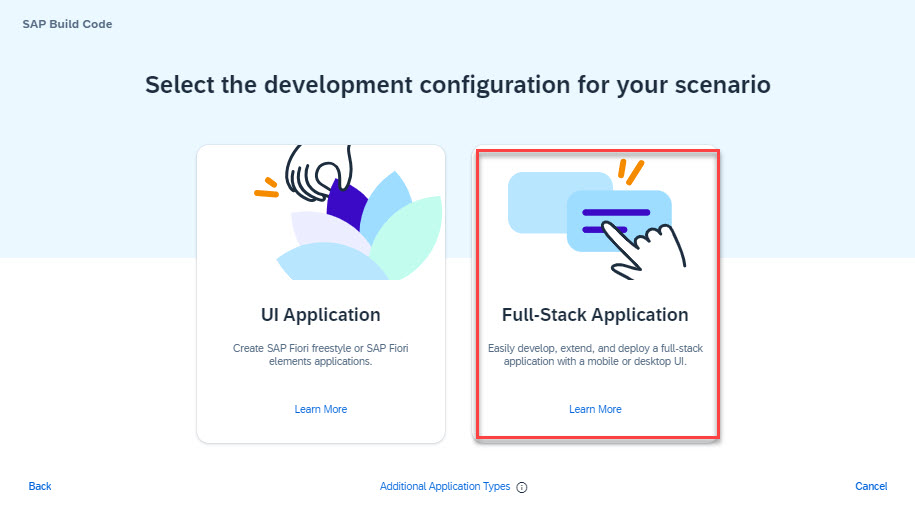

6. On the next screen, enter the following:

|  Input Field   |                   Input Value                   |
| -------------- | ----------------------------------------------- |
| Project Name   | Customer_Loyal_XXX                              |
| Description	 | Customer Loyalty Program Model and Services XXX |

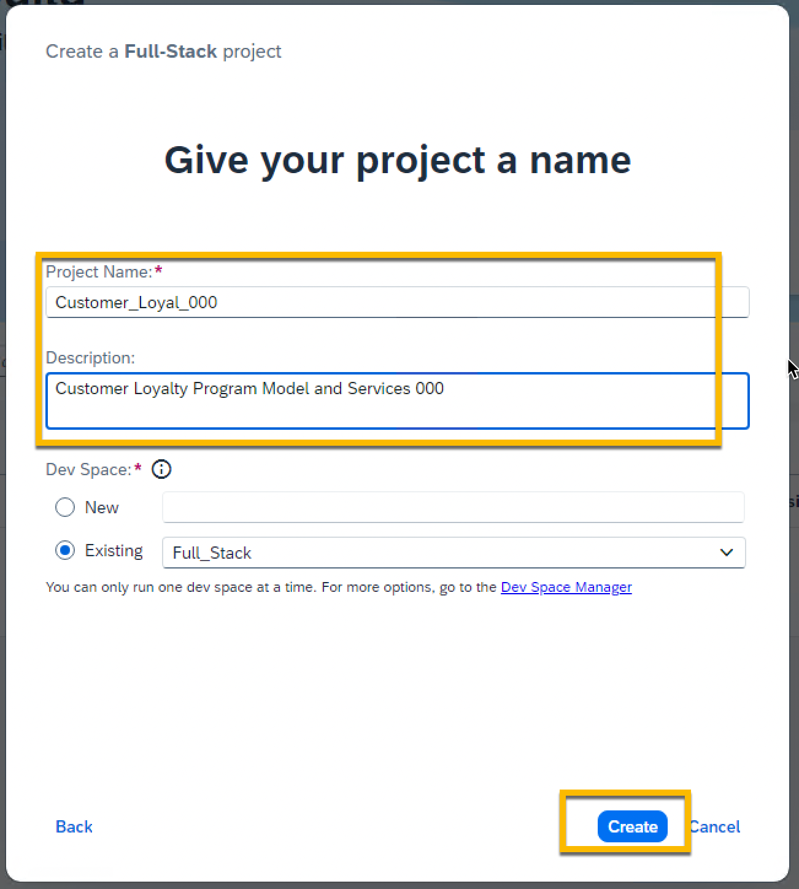

7. Click the Create button.

* The creation of the project can take up to 1 minute.

8. Click on the Customer_Loyal_XXX project.

9. You might be asked to confirm the cookies settings by clicking OK (or Open Settings to update the settings)

10. SAP Build Code will be opened, based on SAP Business Application Studio - in the background.

* Please allow some time for SAP Build Code to open!

---

### Create Data Entities with Joule

In this lesson, we will create the data model and the services for the customer loyalty program application.

We could create the data model visually from the Storyboard or by writing the code manually. However, we are going to use the **generative AI** capabilities of **Joule and SAP Build Code** to generate the code. Thus, significantly **reducing the time and effor**t required to develop the customer loyalty program application.

1. Launch the Joule digital assistant.

* Please wait for the digital assistant to open. If it fails to open then please refresh your browser.

2. Please ask Joule to generate a CAP application by entering **/cap-gen-app** into the prompt.

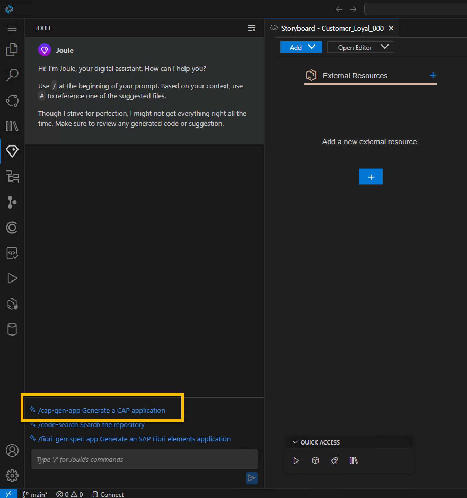

4. Generate the data model and services by copying and pasting the prompt into the box where it says ‘Ask Joule’.

>   
> Design a customer loyalty program application. Define 3 data entities: Customers, Purchases and Redemptions. Each customer must have the following fields: name, email, 7-digit customer number, total purchase value, total reward points, ‘total redeemed reward points’. All fields for each customer should be integer except name and email that will be stored as string. Purchases should include the following fields: purchase value, reward points and selected product. All fields in Purchases must be integer except selected product. Redemptions must have 1 field in integer: redeemed amount. Each purchase and redemption will be associated to a customer. Use Association instead of compositions.
>   

5. Click Generate.

6. The code should be generated now below your prompt.

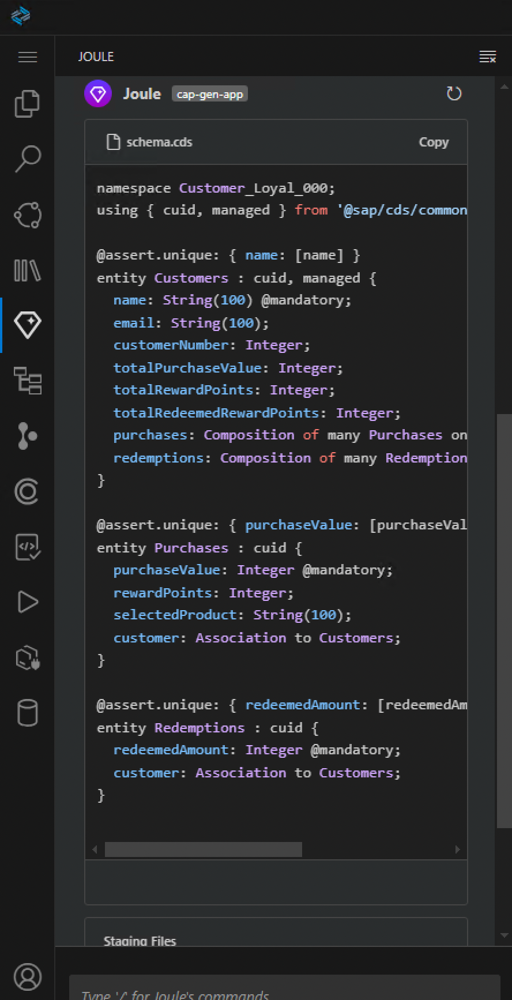

7. Accept the Code by clicking the Accept icon.

* Once you accept the code, you will see the update on the right side under the Storyboard tab.
* It can take up to 2 minutes for Joule to create the data models and services for you.

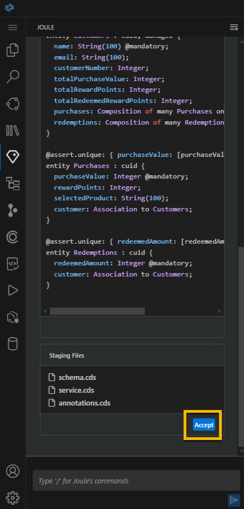

---

# Enhance your Data with Joule

In this lesson, we are going to use the generative AI capabilities of Joule and SAP Build Code to generate some sample data. This sample data will be used to test and preview the backend service of our customer loyalty program application.

### Enhance Customers Initial Data
1. Open the the **Data Editor**. Navigate to **Open Editor**, then select **Sample Data**.

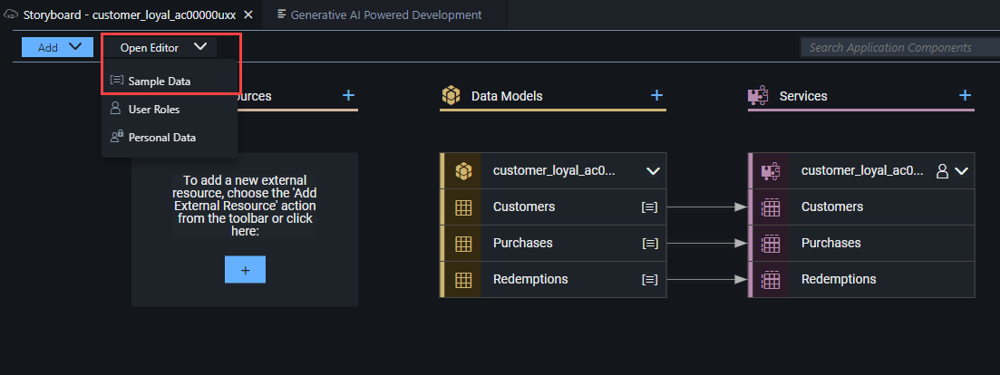

2. Select the **Customers** data entity, then select the **INITIAL DATA** tab.

3. Enter **5** into the **Number of rows** field. Select the **Add** button to add 5 more rows to the entity.

4. Select **Enhance**. This will open again Joule to modify the sample data.

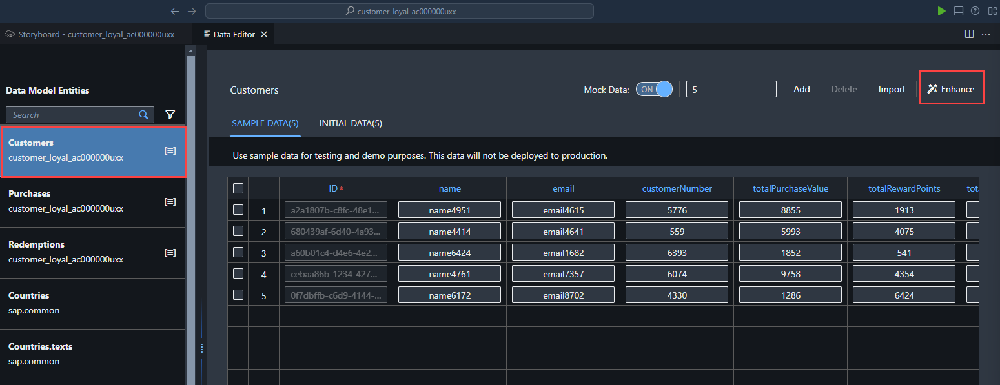

5. **Copy and paste** the following Prompt into Joule and click **Generate**:

> Enhance my sample data with meaningful data. All customer numbers will be 7 digits and one customer must use the customer number 1200547. No field may be empty. Total purchase value must be smaller than 10000. Total reward points and total redeemed reward points both must be unround and different and always sum to one-tenth of total purchase value for each customer.

* Below your prompt, you can see the customer names, email adresses and purchases are created.

6. Select **Accept** to approve the sample customer data generated by Joule.

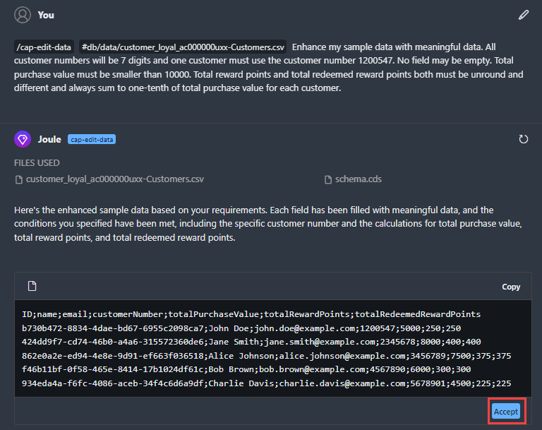

7. You see that the customer Number of one of the customers in the list has been updated to **1200547**.

### Enhance Purchases Initial Data

1. Select the **Purchases** data entity.

2. Select the **INITIAL DATA** tab.

3. Enter **5** into the **Number of rows** field.

4. Select the **Add** button to add 5 more rows to the entity.

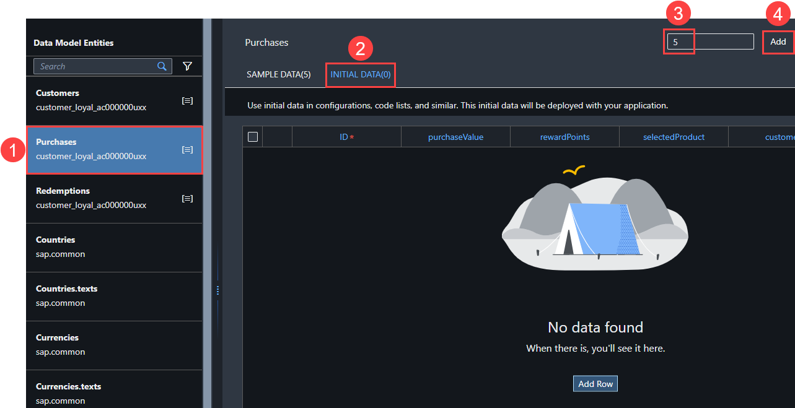

5. Assign a unique customer ID to each purchase entry.

6. Select **Enhance**.

7. Copy the following text for the Prompt in Joule

> Enhance my sample data with meaningful data using electronic office products. Each ‘purchaseValue’ will be between 50 and 1000. Ensure that each ‘rewardPoints’ is always one-tenth of the ‘purchaseValue’. Ensure that the ‘customer’ field is populated.

8. Paste the copied text into the Joule prompt, click **Generate**.

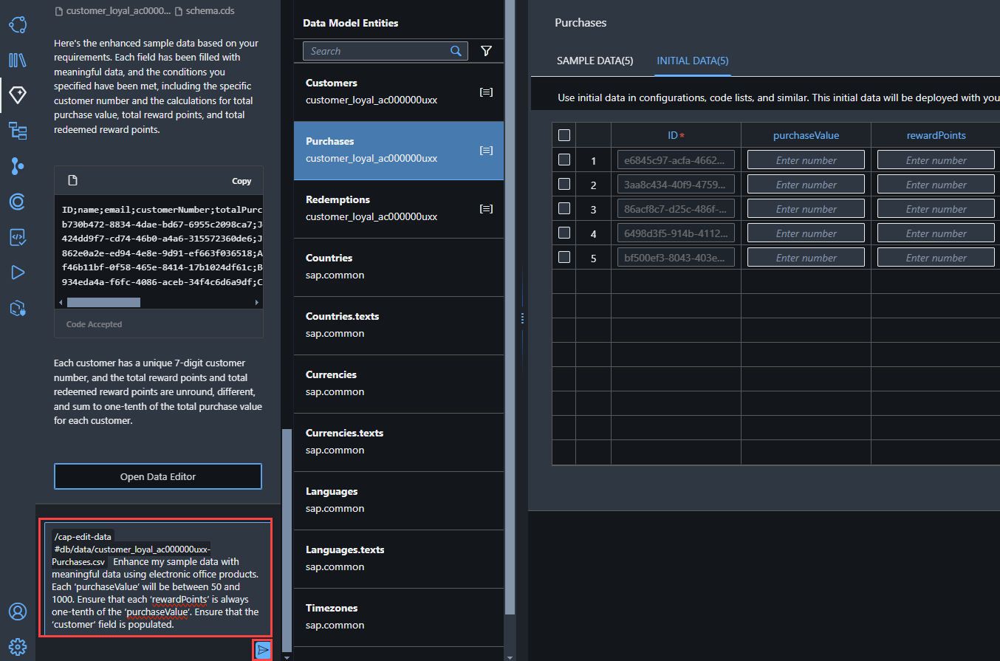

* Wait for Joule … *Thinking* … and the data to be generated. The AI generation may take a little while.

9. Accept the code created by Joule.

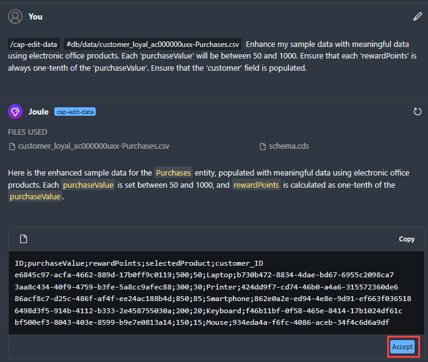

10. The initial data for the **Purchases** entity has been updated.

### Enhance Redemptions Initial Data

1. Select the **Redemptions** data entity.

2. Select the **INITIAL DATA** tab.

3. Enter **5** into the **Number of rows** field.

4. Select the **Add** button to add 5 more rows to the entity.

5. Assign a unique customer ID to each record.

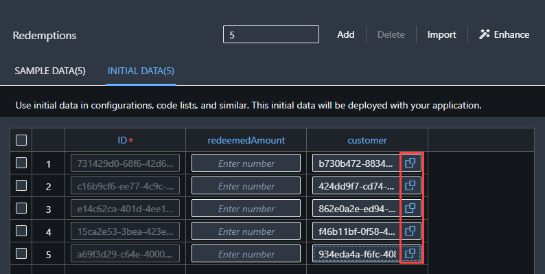

6. Select **Enhance**.

7. Use the following Prompt in Joule:

> Ensure that each redeemed amount is different and between 10 and 100.

8. Click **Generate**. This may take a little time.

9. **Accept** the code created by Joule.

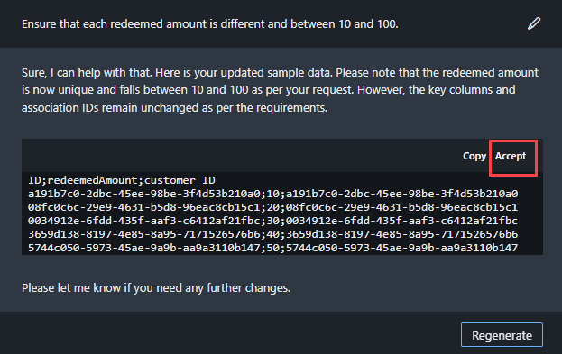

10. The initial data for the **Redemptions** entity has been updated.

---

# Create Backend Logic with Joule

We have already created the entities, services and sample data with Joule. In this lesson, we will add some logic to our application. We would like to calculate the bonus points for each customer purchase. Additionally, we want to provide the logic for customers to redeem their bonus points.

### Purchases Backend Logic
1. In the **Storyboard**, click on one of the entities under **Services** and **Open in Graphical Modeler**

2. Select **Purchases** entity by clicking on the title.

* Note: if you can not see the Purchases entity you may have to zoom out the view.

3. Click on **Add Logic**.

4. Leave everything by the default value and click on **Add**

5. Select the Standard Event **Create**.

* That means this logic will be automatically executed if a new purchase is done.

6. Go to **Open Code Editor > Application Logic**.

* This will open Joule again to create the logic for us.

7. Use the following Prompt in Joule to create a backend logic:

> Reward points of each purchase will be the one-tenth of the purchase value. Each purchase value will be added to the total purchase value of the related customer. Each reward points will be added to the total reward points of the related customer.

8. Click **Generate**.

9. Joule created the following logic:

* Check if the customer exists
* Calculates the rewardPoints from the purchase value
* Updates the total purchase value and the total reward points in the customers entity
10. **Accept** the code created by Joule.

* Joule may generate different codes for the same prompt. If the code for the backend logic differs but achieves the same result, you can ignore the variation and continue working on the exercise.

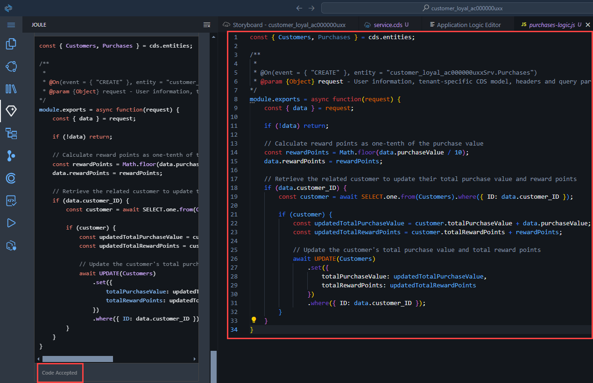

### Redemptions Backend Logic
Now we continue with the Redemptions.

1. Go back to **service.cds** tab.

1. Select **Redemptions** entity by clicking on the title.

1. Click on **Add Logic**.

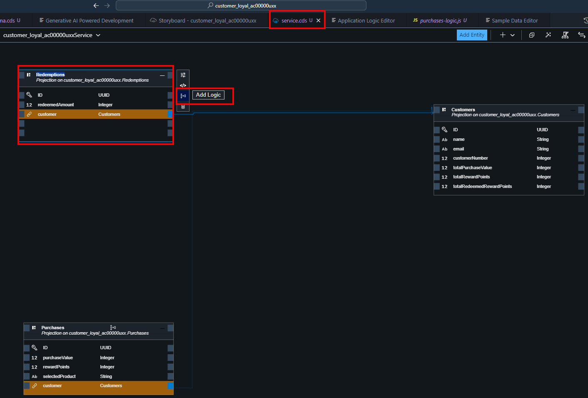

4. Click **Add**.

5. Select **Create**.

6. Go to **Application Logic** under **Open Code Editor**

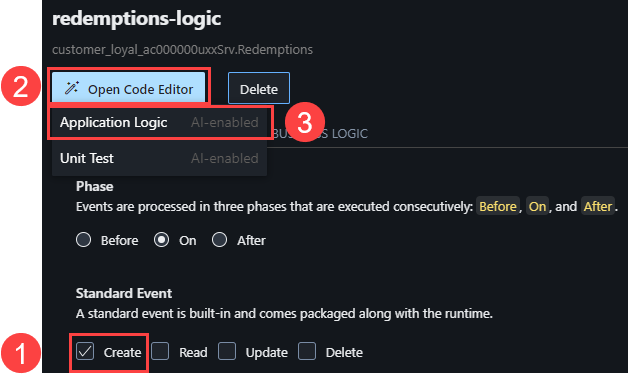

7. Use the following Prompt in Joule to create a backend logic:

> Deduct the redemption amount from ‘totalRewardPoints’ of the related customer. Add the same redemption amount to the ‘totalRedeemedPoints’ of the related customer.

8. **Accept** the code created by Joule.

9. Have a closer look at the generated code. It includes some logic to check if a customer has enough points for the redemption.

* Joule might generate different codes for the same prompt. So, you might have a different code for the backend logic which is completely fine if it does the same job. You can ignore this and keep working on the exercise.

10. Go back to **Storyboard** and open **Service Center**.

---

### Add External Data Resource

In this lesson, we will connect to an S4/HANA system to retrieve the product related data.

1. In **Service Center** go to **SAP System** and find the BTP destination **S4HANA_Joule_Product** (S/4 Product).

2 Select **Add to CAP Project**

**Note**: This destination is already configured by your subaccount admin. The destination is connected to a Sandbox API from SAP Business Hub. For more information about the api go to the SAP Business Accelerator Hub: https://api.sap.com/api/API_PRODUCT_SRV/overview

3. Go to **Storyboard** and check if the **External Resource** got updated.

**Note**: It may take a short time to update!

4. Go to **service.cds** tab and Add Entity

* You can drop the new entity anywhere

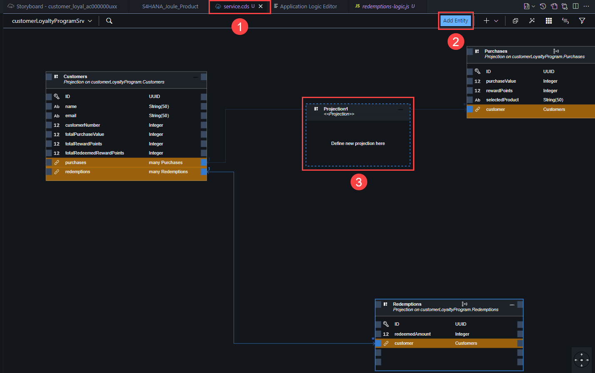

5. Select the data entity: **S4HANA_Joule_Product.A_ProductBasicText**

* **Disable** the **Enable draft editing** option.

6. Click **Save**

---

### UI Application

In this lesson, you’ll design a user interface to showcase and test the content we’ve developed for the customer loyalty program application.

1. Go back to the **Storyboard** and **add a first UI** application by selecting the **(+)**

2. We will start with the user interface for the data entity *Purchases*. Enter the following values:
Display name: **Purchases**
Description: **Manage Purchases**
Data Source: **customer_loyal_XXXSrv**

3. Select **Next**

4. Select **Template-Based Responsive Application** as the UI Application type.

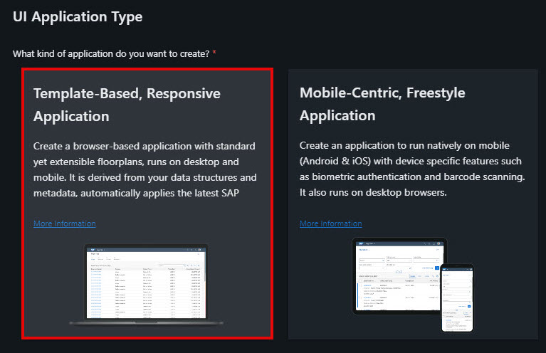

5. Select **Next**

6. Select **List Report Page**

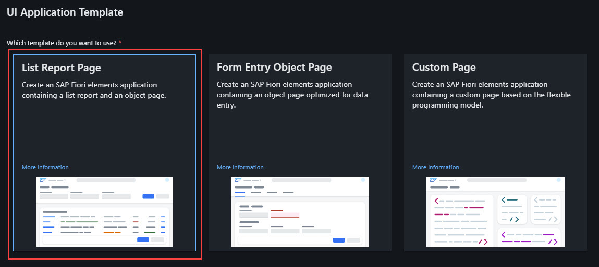

7. Select **Next**

8. Select the **Purchases** entity

9. Select **Finish**

10. Close the Page Map if needed.
Repeat the same steps with the *Customer* and *Redemption* entity.

Customer:

* Display name: **Customers**
* Description: **Manage Customers**
* Data Source: **customer_loyal_XXXSrv**
* UI Application type: **Template-Based Responsive Application**
* UI Application Template: **List Report Page**
* Main Entity: **Customers**
> 
> Wait for the UI to create.
>

Redemptions:

* Display name: **Redemptions**
* Description: **Manage Redemptions**
* Data Source: **customer_loyal_XXXSrv**
* UI Application type: **Template-Based Responsive Application**
* UI Application Template: **List Report Page**
* Main Entity: **Redemptions**
> 
> Wait for the UI to create. You shoud see a message, that the files have been generated.
> 

### Modify the UI for the Purchases
Now we are going to modify the UI for the purchases. We will include the products from S/4HANA as value help in the purchases and hide some fields.

1. Go back to the Storyboard.

2. elect the **Purchases UI** and open it in the **Page Map**.

* To see which is the Purchases UI, move mouse pointer over the UI to extend the displayed name.

3. We want to modify the **Object page**. Therefore select the **edit** icon

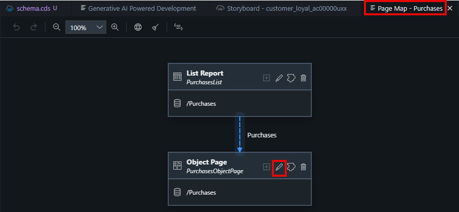

4. In the Sections, expand **General Information** then expand **Form** and then expand **Fields**.
* Afterwards it will look like this:

> 
> The reward points are calculated automatically by the logic Joule has created for us.
> 

5. Delete the **Reward Points** field by pressing the trash bin icon next to it and **Confirm** the deletion.

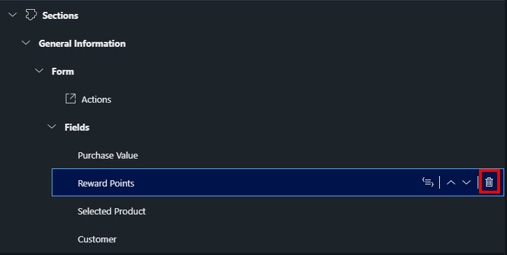

Instead we want to select the products from S/4HANA for the purchases.

6. Select the field **Selected Product** and change the **Display Type** in the properties on the right side to **Value Help**.
Set the following:

* Label: **Product**
* Value Source Entity: **A_ProductBasicText**
* keep the rest as it is.

7. Select **Apply**

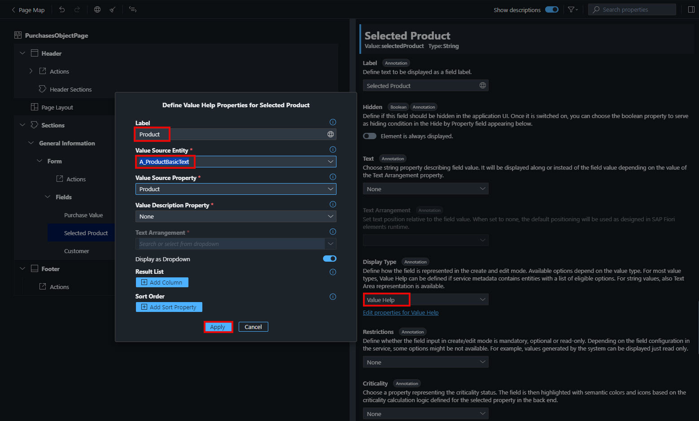

---

### Preview

In this lesson, we’ll review the customer loyalty program application you’ve just built.

1. To preview your application, go to the upper-right corner, and select **Run and Debug**.

2. Select Run customer_loyal_XXX

3. The application’s preview is displayed.

4. Select **Go** and navigate through each of the tiles (**Customers, Purchases. Redemptions**) in the Customer Loyal UI to see the generated data. Please note that in the application Preview not all functions may be available.

Congratulations! You have successfully built and previewed a CAP application using **SAP Build Code** powered by **Joule copilot**!

---

# Prepare & Deploy CAP Application

### Preparation

#### Service
If you want to create a customized UI with SAP Build Apps on top of it, we need to adjust some settings in the service.

To do this, we will use the *Graphical Modeler* to disable the “Draft Editing” mode for all three entity sets:

* Customers
* Purchases
* Redemptions

1. Go to **service.cds** tab. Select the **Redemptions** entity and the **Redemptions** details will appear on the right hand side.

2. Select **Settings** => Disable **Draft Editing**.

* If you do not see *Settings* may have to move the *Show Details* content to the left

3. Select **Customers** and disable *Draft Editing*

* You may have to move around to find Customers.

4. Select **Purchases** and disable *Draft Editing*

---

### Deployment
The final step in SAP Build Code is to deploy the application to CloudFoundry. This process also involves the automatic creation of destinations, enabling ODATA services to be utilised by other tools such as SAP Build Apps.

1. For the deployment go to **Task Explorer** and select the Play icon (**Run**) next to **Enable Discovery and Deploy** option.

* Please be patient as this may take a few minutes.

2. Check if the task has launched in the terminal

3. During the deployment a new page will be opened to to sign into Cloud Foundry.

4. Please note that this is a shared landscape so we need to minimise the size of your application. Before deploying the application to Cloud Foundry, we need to set the memory footprint of the application.

* Select the **EXPLORER** icon and open the **mta.yaml** file.

* Search the **memory** parameter of your application and change the value to 64MB.

* Right select the **mta.yaml** file and select **Build MTA Project**

* When the job is complete, the following message is printed to the **Terminal**.

5. Return to the **Cloud Foundry Sign In and Targets** page.

* Enter the correct endpoint: **{placeholder|cfapi_code}**

* Select **Open a new browser page to generate your SSO passcode**

6. Enter **{placeholder|idp}** and select **Sign in with alternative identity provider**.

7. Copy the **Temporary Authentication Code**.

8. Paste the **Code** and **Sign In**.

9. Select the Organization and Space as specified here:

Organization: **{placeholder|cforg_code}**
Space: **AC_SAPBUILD**
Select **Apply**

10. After the successful deployment (May take several minutes) you will find the link of the deployed application in the terminal.
* Use **Ctrl+click** to try it out!

11. Explore the UIs that you have created

12. Select **Go** in each of the tiles (**Customers, Purchases. Redemptions**) in the Customer Loyal UI to see the generated data.

**Congratulations!** You have used the generative AI capabilities of Joule in SAP Build Code, to create a CAP service for a **customer loyalty program application**.

---